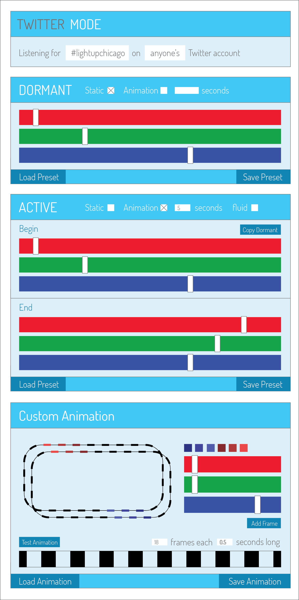

#Loop Lamp Interactive Interface

This repository contains the code for the [Light Up Chicago](http://lightupchicago.org/) project. 

Below is a prototype interface that allows users to program their Loop lamps. This example is not a representation of how the final version of this page will look but rather an illustration of its interactive and programmable features. 

Using the interface below lamp owners will be able to control the colors and behaviors of their lamps as well as create, save, and load preset behaviors. Owners will also be able to create their own custom animations as each individual LED on the Loop lamp is individually controllable.  

