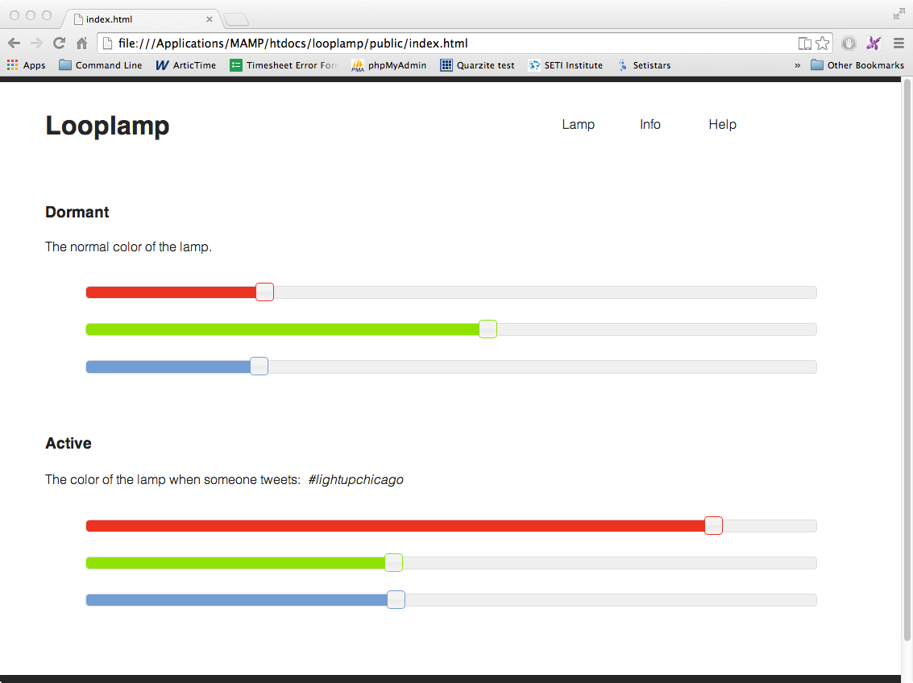

#Looplamp

This repository contains the code for the [Light Up Chicago](http://lightupchicago.org/) project.

  

Looplamp is developed by [DSSG](http://dssg.io), [Inventables](http://inventables.com), @mperez4, @brannondorsey, and @notandrewkay. 

# Web interface feature list

Features for Looplamp 1.5

- Color sliders are live auto-updated on all connected devices using socket.io.
- Autoupload: The lamp immediately visualizes any colors from the sliders as they are moved.   1-2 seconds after they are released the behavior is saved and "preview" mode is finished with no button press needed.
- Preset animations: A list of animation demos that come pre-loaded with the lamp. 
	- Random color blink
	- Serene color change
	- Spiral color
	- Volume visualizer (if mic-plugged in)
- Info and links to external documentation/help resources.

Features for Looplamp 2.0

- On/off button from the browser.
- Custom animation tool
- Full documentation and "Getting Started" resources + API reference
- Possibly connected to Google Coder <-- unsure if this is necessary. 